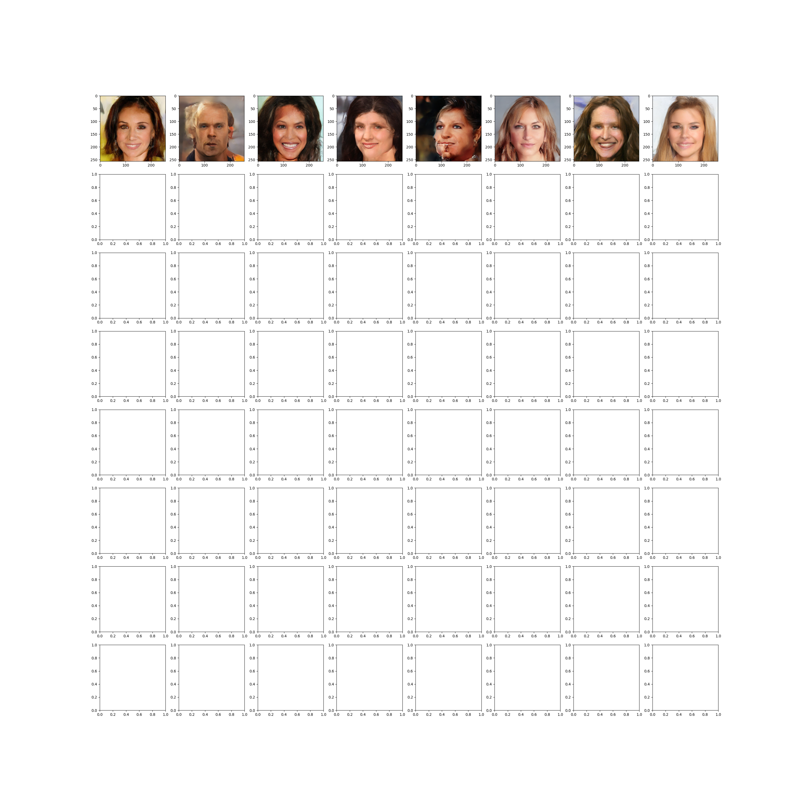

## One-Step Diffusion via Shortcut Models 

This is an unofficial PyTorch implementation. Original implementation in jax might be found here: https://github.com/kvfrans/shortcut-models

At the moment there is a very basic implementation with 2 modes: naive(simple flow matching) and shortcut.

Implementation allows to train in multi-gpu mode, thanks to pytorch-lightning

## Data

I used celeba-hq dataset from HuggingFace for image generation task https://huggingface.co/datasets/mattymchen/celeba-hq

## Using the code

There is a helpful Dockefile and docker-compose in this repository which install all necessary libraries.  

In order to run just write:

```
python train.py
```

## Results(300 epochs of shortcut training):

128 denoising steps:

<p align="center">
  
</p>


16 denoising steps:

<p align="center">
  
</p>

8 denoising steps:

<p align="center">
  
</p>

4 denoising steps:

<p align="center">
  
</p>

2 denoising steps:

<p align="center">
  
</p>

1 denoising step:

<p align="center">
  
</p>
